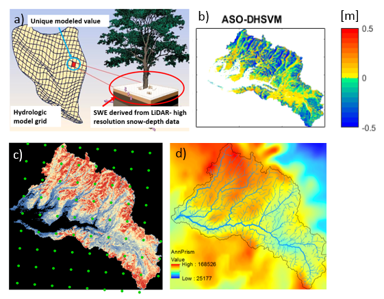

### Project Title: Comparing modeled and LiDAR-derived snow water equivalent spatial datasets

- Data Science Lead: Nicoleta Cristea
	
#### The problem

Many geospatial problems require an assessment of the spatial variability of environmental data. This is often used to explore the errors between modeled and observed geospatial fields. For example, we often need to know not only the mean difference between datasets, but how those differences vary across the landscape. In addition, just examining the spatial statistics in a geophysical field may reveal things about land surface physcial processes.

#### Application Example

The Sierra Nevada Mountain snowpack provides water for California's cities and agriculture, and has been under substantial stress in the past recent years due to both increased air temperatures and reduced precipitation. Estimating total snow water equivalent (SWE) stored in the snowpack is critical to support spatially distributed hydrologic forecasts and water management. In 2013 the NASA Airborne Snow Observatory (ASO), an airborne LiDAR system, began flying over the Tuolumne watershed (1190 km^2), the source of San Francisco water supply, weekly during the snow ablation season. NASA processed the high resolution (1-3m) raw LiDAR-derived snow depth to obtain 50-m resolution SWE (data available [here](http://aso.jpl.nasa.gov/)). This transformed SWE dataset can be compared to representations of SWE in distributed hydrologic models and aid in evaluating model performance (Figure 1). We use the Distributed Hydrology Soil Vegetation Model ([DHSVM](http://www.hydro.washington.edu/Lettenmaier/Models/DHSVM/)) run at 90-m resolution. DHSVM explicitly includes topographic shading, fully-distributed energy balance and forest-snow-interaction algorithms. We use distributed meteorological data from the Weather Research model (WRF) as input to the hydrologic model. Precipitation at the WRF nodes are further downscaled at the model scale using [PRISM](http://www.prism.oregonstate.edu/)-derived weights.

 

 

Hydrologic model grid representation (for each model 90-m grid cell a single value is computed) b) spatial distribution of model error for May 5th, 2014, c) distribution of 6-Km WRF nodes across the watershed, and d) 800-m PRISM precipitation climatology.

#### Sample data

The data provided consist of the following, all located over the Tuolumne River watershed:

* DHSVM-modeled SWE on 11 days in 2014 (geotiff)
* LiDAR-derived SWE at 90-m resolution resampled from the original 50-m to match DHSVM scale on the same 11 days in 2014 (geotiff)
* 90-m Digital Elevation Model (DEM) (geotiff)
* 90-m binary vegetation map: 0 = no forest; 1 = forest (geotiff)
* 800-m PRISM precipitation climatology (geotiff)
* 6-km WRF meteorology (netcdf)

 
#### Existing methods

This type of work is often carried out using spatial statistics tools in ArcGIS.

#### Research Questions

The primary question: what are the reasons for differences between the predicted snow water equivalence from the hydrological model versus those from the LiDAR observations?

Related questions:

1. Examine the spatial error structure (ASO-DHSVM, Figure 1b) for 11 days. Are errors higher on specific slopes/aspects/shaded or vegetated areas?
2. Do certain areas of the watershed have larger errors than others due to WRF-derived precipitation variability?
3. What metrics are useful to quantify goodness-of-fit? 

#### Possible Methods

Identify and use spatial statistics and metrics to characterize SWE error variability. Potential methods range from simple data exploration techniques (plotting, slicing, subsetting and grouping), moving window statistics and correlation/regression, to more sophisticated variogram and principal component analyses. 

#### Potential tools:

* [scikit-learn](http://scikit-learn.org/stable/index.html)
* Earth System Modeling Framework Python interface: [ESMPy](https://www.earthsystemcog.org/projects/esmf/)
* [xarray](http://xarray.pydata.org/en/stable/)
* [custom WRF data exploration and subsetting tools](https://github.com/NCristea/WRF_processing)

#### Background reading: 

* Revuelto, J.J. I. Lopez-Moreno,C. Azorin-Molina, and S. M. Vicente-Serrano (2015),Canopy influence on snow depth distribution in a pine stand determined from terrestrial laser data,Water Resour. Res., 51, 3476-3489, doi:10.1002/2014WR016496.
* Revuelto, J., J. I. Lopez-Moreno, C. Azorin-Molina, and S. M. Vicente-Serrano (2014), Topographic control of snowpack distribution in a small catchment in the central Spanish Pyrenees: Intra- and inter-annual persistence, Cryosphere, 8, 1989-2006, doi:10.5194/tc-8-1989-2014.

