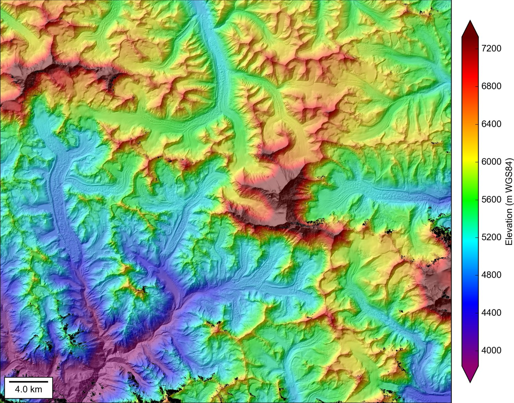
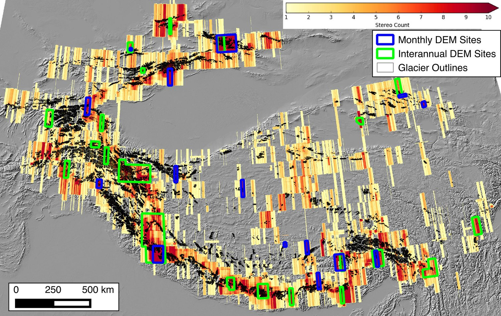

# Glacierhack

* [github](https://github.com/dshean/stereohack)

Big glaciers. Big data. Big tools. Big results.

## Collaborators on this project

- Data science lead: [David Shean](https://github.com/dshean)
- Project lead: Zach Lifton
- Brad Bates

## The problem

How can we systematically (and accurately) estimate glacier mass balance across a range of spatial scales (individual glaciers, regional) and time periods (~50-year, decadal, annual, seasonal)?  

How can we analyze these measurements to better understand the drivers of observed change?

How can we use these measurements to calibrate and validate models (e.g., energy balance models, ice flow models)?

What are implications for climate change and water resources?

### Application Example

The approaches we will consider are relevant for understanding the mass balance and dynamics of large ice sheets (i.e., Antarctica, Greenland), ice caps (e.g., Svalbard, Iceland) and mountain glaciers (e.g., Nisqually Glacier on Mount Rainier) on the Earth and even other planets (Mars!).

For the geohackweek, I propose that we pursue a regional analysis of mountain glaciers - big enough to be interesting, but not overwhelming.  Candidate sites include:
- High Mountain Asia (including mountain glaciers in Himalayas, Karakoram, Tien Shan, etc).
- CONUS glaciers 
- Arctic glaciers and ice caps

High Mountain Asia with political boundaries, hydro features, and labels:

Glacier polygons, repeat high-res stereo DEM coverage, and candidate study sites for High Mountain Asia:

## Data   

We will focus on deriving volume change and geodetic mass balance from repeat observations of glacier surface elevation.  To do this, we will need to integrate raster and vector datasets.

### Vector data
- Glacier polygons
    - [Randolph Glacier Inventory (RGI)](http://www.glims.org/RGI/)
- Point elevation data
    - [ICESat-1 laser altimetry data](http://nsidc.org/data/GLAH14/versions/34) (http://icesat.gsfc.nasa.gov/icesat/)

### Raster data
- Raster elevation data
    - High-resolution DEMs derived from DigitalGlobe commercial stereo images: 
        - UW APL archive
        - [Polar Geospatial Center archive] (http://www.pgc.umn.edu/elevation)
    - [Shuttle Radar Topography Mission (SRTM)](http://www2.jpl.nasa.gov/srtm/)
    - Airborne LiDAR 
        - [US Interagency inventory](https://coast.noaa.gov/inventory/)
    - [ASTER L3 DEM products](https://lpdaac.usgs.gov/dataset_discovery/aster/aster_products_table/ast14dem)
    - Historical DEM data (e.g., NED, Declassified stereo satellite imagery)
- Image data
    - [DigitalGlobe imagery](https://browse.digitalglobe.com/imagefinder/)
    - Landsat, MODIS

### Specific Questions 

- How do we handle 1000s of glacier polygons?
    - explore vector processing and database options presented during tutorials
    - manipulate RGI records
- How do we organize, process and analyze 100s-1000s of high-res raster datasets?
    - explore raster processing options presented during tutorials
    - efficient resampling/warping approaches
    - array manipulation and calculations
- How to work with extremely large arrays (e.g., 200Kx200K px images)?
    - efficient memory management
    - tiling and multi-threading

### Existing methods

Traditional glaciological measurements rely on field observations and sparse stake measurements - limited to a few glaciers, but long historical records

Deriving geodetic mass balance measurements from repeat DEMs is nothing new, but many past studies have limited spatial extent and often include only a few datasets.  

### Proposed methods/tools

We will leverage a number of open source tools:
- [GDAL/OGR][1] - raster/vector processing
- [elevation][2] - SRTM data download
- [NASA Ames Stereo Pipeline][3] - command-line tools for photogrammetry and working with huge rasters
    - `image_calc` - multi-threaded, memory-efficient raster calculations
    - `dem_geoid` and `datum_convert` - multi-threaded, memory-efficient datum conversions
    - `pc_align` - generalized iterative closest point (ICP) DEM and point cloud co-registration
    - `dem_mosaic` - seamless raster mosaic generation
    - `point2dem` - gridding point data (point clouds from airborne LiDAR, photogrammetry)
- [pygeotools][4] - Python libraries and utilites for raster/vector processing 
- [demcoreg][5] - Python utilities for DEM co-registration and differencing
[1]: http://www.gdal.org/
[2]: https://github.com/bopen/elevation 
[3]: https://ti.arc.nasa.gov/tech/asr/intelligent-robotics/ngt/stereo/
[4]: https://github.com/dshean/pygeotools
[5]: https://github.com/dshean/demcoreg

We will also explore new approaches for raster and vector processing/analysis covered in the tutorials.

We will assemble co-registered DEM time series, compute elevation differences, and convert to mass change.  Depending on interests and time, we will also develop basic analytical tools: 
- Hypsometric analysis
- Regression analyses (slope, aspect)
