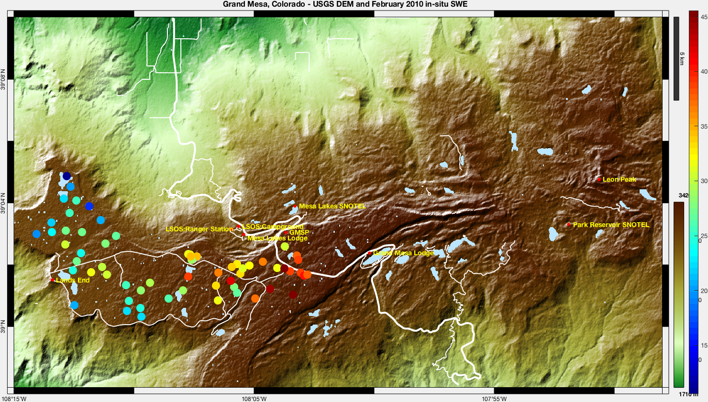
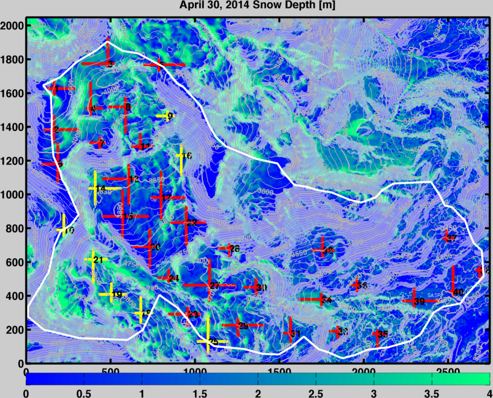

# SnowExHack

* [github](https://github.com/hpmarshall/snowex)

Remote sensing of snow for hydrological applications.  In search of the holy grail of seasonal snow remote sensing - SWE from space.

## Collaborators on this project

- Data science lead: [HP Marshall](https://github.com/hpmarshall)
- Project lead: Kelly Elder
- Ludo Brucker
- Chris Heimstra
- many others

## The problem

What is the optimal combination of spaceborne instruments to retrieve Snow Water Equivalent (SWE) from space?

How does the accuracy of SWE retrieval for different sensors (e.g. LiDAR, radar, photogrammetry) change in different vegetation?

How does the accuracy of SWE retrieval for different sensors (e.g. LiDAR, radar, photogrammetry) change in complex topography?

What is the minimum resolution required to retrieve SWE accurately in the mountains?

How can we optimize the ground-based sampling strategy for SnowEx Years 3-5?

### Application Example

Using the in-situ data from the large February 2017 field campaign as "truth", we will evaluate the accuracy of several different airborne remote sensing retrievals, over a range of vegetation and topography:

- SWE retrieval from airborne L-band InSAR (UAVSAR) phase changes
- depth retrieval from airborne LiDAR (Airborne Snow Observatory)
- depth retrieval from airborne Ka-band InSAR (GLISTIN-A)
- SWE retrieval from airborne X-/Ku-band radar scatterometers (ESA SnowSAR, NASA Wideband Instrument for Snow Measurements)
- sensor fusion approaches with the above

This will require the development of a database that includes many different ground-based and airborne observations, a versioning system to track changes during QA/QC, and an approach to organizing various levels of data products as they become available.  Products such as vegetation type, vegetation height, and topographic variables will need to be derived.  Airborne and field observations took place over a month-long period, therefore tools for searching the database for (nearly) coincident observations in time and space will be needed.  Observations from 7 different energy balance weather stations will need to be accessible to interpret comparisons of data collected at different times.

For Geohackweek 2017, I propose to develop the framework for this database system, and begin the development of tools to perform this geospatial analysis.  SnowEx 2017 was performed at two locations, Grand Mesa and Senator Beck Basin, Colorado.  Grand Mesa is a broad flat mesa at 10-11,000 ft, with simple topography, a range of vegetation, and a strong East-West gradient in SWE.

Senator Beck is located in the San Juan Mountains in SW Colorado, has complex topography, with elevations from 11,000-13,500ft.  Much of the study basin is above treeline in the alpine, and this is a closed first order basin, with a gauged outlet, and is therefore ideal for using SWE retrievals to drive a hydrologic model, for comparison with streamflow.  This site was developed and is maintained by the Center for Snow and Avalanche Studies (http://www.snowstudies.org/), has more that a decade of continuous meteorological observations, and is one of the few high alpine full energy balance sites in the U.S.

## Data   

Evaluation of SWE and snow depth retrieval accuracy, in a range of vegetation and topography, will require many different types of data.

### Point data
- Continuous meteorological and snow observations at 7 automatic weather stations
- Snowpit measurements (density, depth, stratigraphy)
- Terrestrial LiDAR scans (point clouds of snow depth, vegetation height, surface roughness)
- Continuous tower-mounted radar observations (SWE, depth, EM travel-time)

### Vector data
- Snow depth transects (standard and MagnaProbe)
- Ground-based radar transects (snow depth, SWE, stratigraphy, EM travel-time)

### Raster data
- LiDAR snow depth (1-3 m resolution)
- L-band InSAR phase/amplitude/coherence (1-5 m resolution)
- Ka-band InSAR (1-5 m DEM)
- NASA WISM / ESA SnowSAR backscatter (5 m resolution, X- and Ku-bands)

## Specific Questions 

- How do we handle many different versions of datasets and derived products, and make them accessible to the snow community?
    - GIT versioning for datasets?
- How do we best handle large datasets with very different characteristics (time series, vector, raster, point)
    - SQL database?  Want this to be open source
- How do we efficiently query and return subsets of large data at various resolutions?
    - tiling, memory management

## Existing methods

Passive microwave SWE retrievals - limited to shallow snowpacks, does not work in mountainous terrain.

GRACE mass change - combines changes in SWE, soil water storage, groundwater; resolution challenging in mountains, but likely powerful in combination with other remote sensing.

Field surveys / in-situ observations (e.g. peak SWE surveys, SNOTEL) - undersample snow patterns, due to 50-200m correlation lengths.  Long temporal records and assumption of stationary climate required.

Airborne LiDAR - proven method to retrieve snow depth distribution at basin scale.  Requires estimate of snow density.  Resolution from spaceborne platform likely too low for this application.

## Proposed methods/tools

Explore tools that will be covered during Geohackweek 2017...

SQL database, port MATLAB libraries of radar/LiDAR code to python, implement version control for both code and datasets

## Background reading

https://snow.nasa.gov/snowex

Need to add list of relevant references...