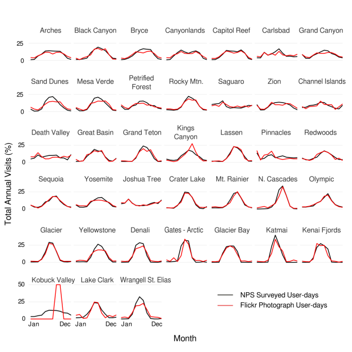
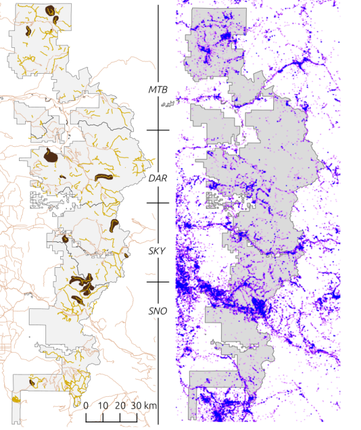

# SocialMediaTrails

Provide managers of public lands with useful data on visitation rates for hard-to-monitor areas like backcountry trails, using geolocated social media as a data source.

## Collaborators on this project

- Data science lead: 
- Project lead: Dave Fisher

## The problem

Outdoor recreation is one of many important benefits provided by public lands. Data on recreational use are critical for guiding management decisions on public lands, however, managers often lack actionable information on visitor use for large areas without controlled access points. 

This project will advance methods that incorporate user-generated social media (e.g. geotagged images shared on Flickr) into maps and models of visitation rates to trails across WA State.

Some existing results and applications of these data:

#### In US National Parks

#### In the Mt. Baker-Snoqualmie National Forest

### Application Example

Collect a statewide GIS database of trailhead points and trail line segments, and use them to query the global set of geotagged photographs shared publicly on Flickr. For each trail, build metrics of monthly or annual "photo-user-days"and map these relative visitation rates to trails across the state. 

Integrate this database with trail attribute data and build models that can show how trail features (e.g. accesibility, natural features, built infrastructure) influence visitation patterns. Models can take various forms, from a simple linear regression to an agent-based model that distributes hikers across a landscape, and explores effects of management actions (e.g. road building/closure, amenities development, restoration, etc.).

## Data   

The example described above might rely on the following data sources, among others

### Trails GIS data
https://www.arcgis.com/home/item.html?id=f7e9f357823a406abfc1ac89535c2470

### Flickr data
- Accessible via [InVEST Recreation Model](https://www.naturalcapitalproject.org/invest/)
- [Yahoo Flickr Creative Commons 100 Million dataset](http://yfcc100m.appspot.com/)

### Trail attribute data
- [Washington Trails Association Hiking Guide](http://www.wta.org/go-outside/hikes)
- many other sources to integrate

## Existing methods

The InVEST Recreation model is built on top of the global set of geotagged flickr photos, and provides an API for this database. This tool allows querying of the database with a shapefile, and summarizing results into [photo-user-days](http://data.naturalcapitalproject.org/nightly-build/invest-users-guide/html/recreation.html#rec-photos)
- http://data.naturalcapitalproject.org/nightly-build/invest-users-guide/html/recreation.html
- https://bitbucket.org/natcap/invest

Lots of validation has been done to show that photo-user-days are correlated with empirical visitation rates, see some of the papers below. Lots more validation is ongoing.

## Background reading

Wood, Spencer A., Anne D. Guerry, Jessica M. Silver, and Martin Lacayo. 2013. “Using Social Media to Quantify Nature-Based Tourism and Recreation.” Scientific Reports 3 (October). doi:10.1038/srep02976.

Sessions, Carrie, Spencer A. Wood, Sergey Rabotyagov, and David M. Fisher. 2016. “Measuring Recreational Visitation at U.S. National Parks with Crowd-Sourced Photographs.” Journal of Environmental Management 183, Part 3 (December): 703–11. doi:10.1016/j.jenvman.2016.09.018.

Keeler, Bonnie L, Spencer A Wood, Stephen Polasky, Catherine Kling, Christopher T Filstrup, and John A Downing. 2015. “Recreational Demand for Clean Water: Evidence from Geotagged Photographs by Visitors to Lakes.” Frontiers in Ecology and the Environment 13 (2): 76–81. doi:10.1890/140124.
