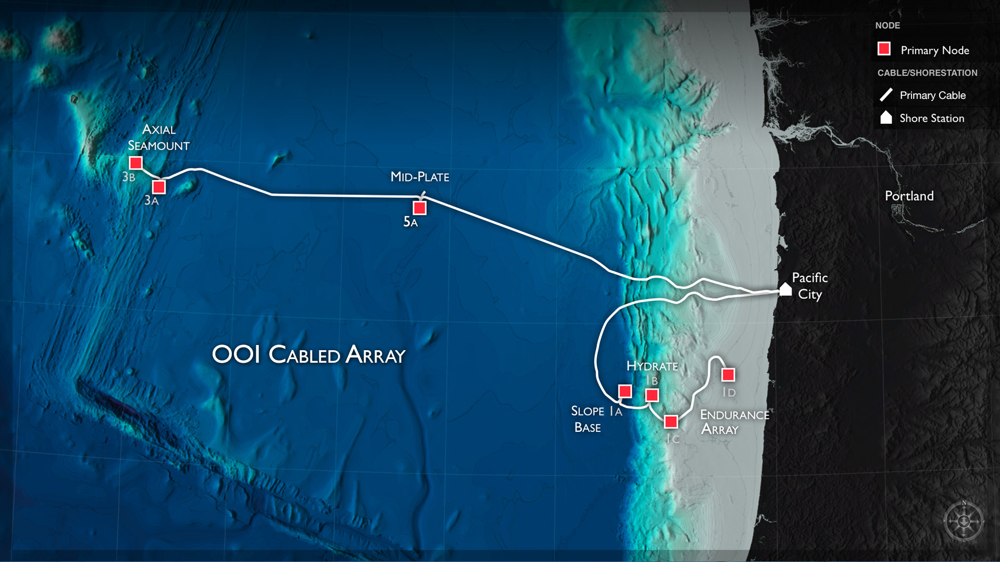
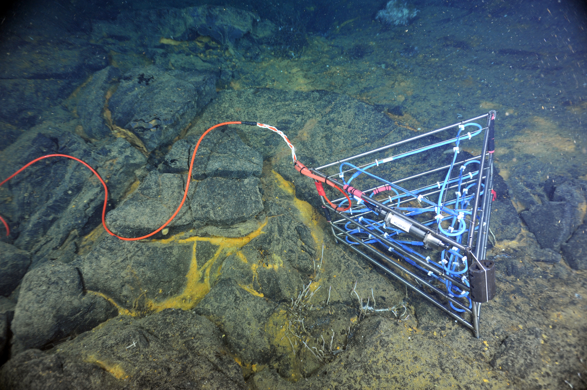
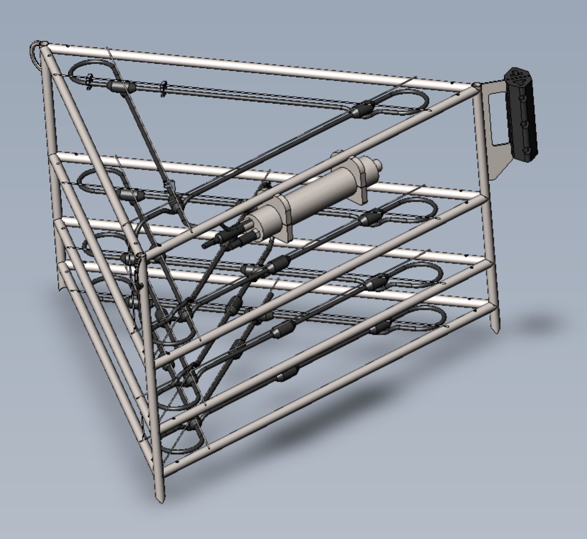

# 3D Thermistor Array

The OOI Cabled Array, maintained and operated by the University of Washington, is delivering real-time data from a [3D Thermistor Array](http://www.interactiveoceans.washington.edu/story/Thermistor_Array) deployed inside the caldera of [Axial Volcano](http://www.interactiveoceans.washington.edu/story/Axial_Caldera_PN3B_Fully_Installed). The 3D array consists of 24 temperature sensors at fixed [x, y and z positions](https://github.com/friedrichknuth/ghw2017/blob/master/projects/VizHack/projects/3D_Thermistor_Array/info/frame_geometry.pdf). A new measurement is made every ten seconds and data is available since 2014 up until present. The data can be retrieved in NetCDF or JSON formats. See examples under [starter_scripts](https://github.com/friedrichknuth/ghw2017/tree/master/projects/VizHack/projects/3D_Thermistor_Array/starter_scripts).

The goal is to interpolate and visualize the plume of hot water coming up from beneath the 3D Thermistor Array over time. This will help scientists understand if the tidal forcing mechanism is suppressing the plume into the subsurface or simply moving it back and forth above the seafloor with the rhythm of the tide.

The problem could be tackled in three stages:

* Produce a 3D visualization of the temperature plume at a given point in time and serve it up on [sketchfab](http://yt-project.org/doc/visualizing/sketchfab.html), for example.

* Produce an interactive 3D time lapse of the plume.

* Visualize the plume in realtime as the data streams ashore.

## Possible tools

- [mplot3D](https://matplotlib.org/mpl_toolkits/mplot3d/tutorial.html) - Matplotlib targeting 3D vizualization.

- [ytini](http://www.ytini.com/) - Which is [yt](http://yt-project.org/doc/index.html) + [houdini](https://www.sidefx.com/).

- [Paraview](https://www.paraview.org/) - A powerful package for plotting in 3D, as mentioned.

- [bokeh](http://bokehplots.com/pages/about-bokeh.html) and [Datashader](https://datashader.readthedocs.io/en/latest/) - maybe?

- [d3](https://d3js.org) - Or maybe D3 proper has something applicable? Perhaps there is something new in the oven at the [IDL](https://idl.cs.washington.edu/) ??