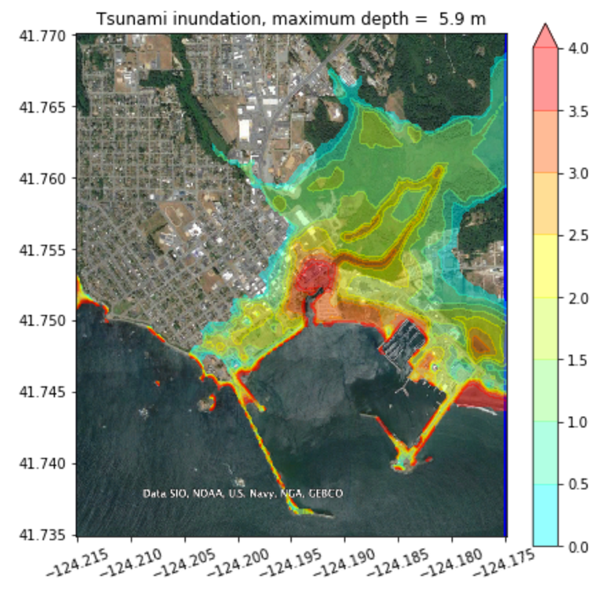
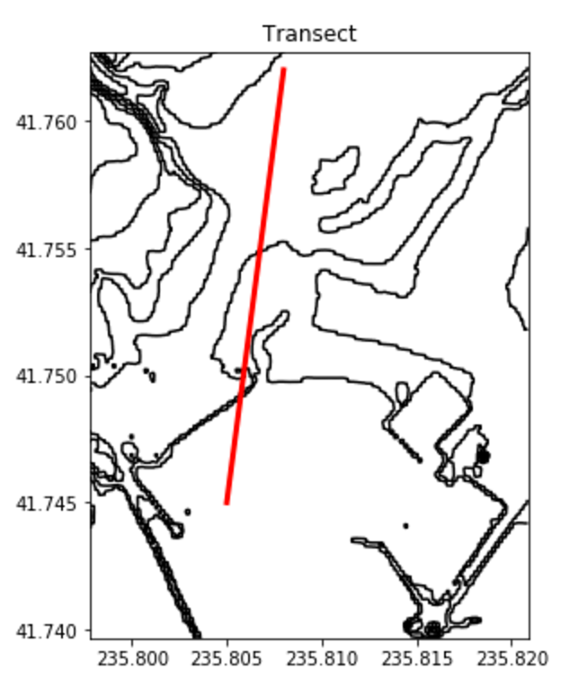

# Vizhack

*Add some images*

## Project leads

- [Randy LeVeque](http://faculty.washington.edu/rjl/), [@rjleveque](https://github.com/rjleveque)
- [Tony Cannistra](http://escience.washington.edu/people/tony-cannistra/), [@acannistra](https://github.com/acannistra)
- [Ray Cakir](http://file.dnr.wa.gov/publications/ger_bio_recep_cakir.pdf)

## Github repository

https://github.com/geohackweek/vizhack will be used to develop and share code.  A sample notebook to create plots such as those seen above is in [notebooks/Interactive_Transects.ipynb](https://github.com/geohackweek/vizhack/blob/master/notebooks/Interactive_Transects.ipynb) 

## The problem

Create a set of tools to visualize data that represents depth above topography (e.g. tsunami flow depth, landslide runout depth, glacier depth) that allows plotting both in plan view (e.g. color maps on top of topography contours, imagery, and/or maps) and in a 3D view (with topography and depth quantity plotted using different color maps), along with easy ways to explore the data (e.g. click a point to print the depth there, click two points to define a transect and have another plot pop up with the topography and depth along the contour, etc.).  Ideally this would work well both in a Jupyter notebook and also for rendering in javascript on webpages (e.g. for emergency managers or the public to view and explore the data dynamically).

There are many possible extensions to more complicated situations, depending on the interests and needs of the project participants. For example:

- Time-dependent data, e.g. flooding due to a tsunami, storm surge, dam break, or data from dynamic landslide models. Tools to make animations and interact with them, e.g. stop at one frame, zoom in, extract a transect, etc.

- Visualizing and interacting with 3-dimensional data sets, e.g. a volcanic ash plume in the atmosphere, subsurface groundwater flow, seismic waves propagating in the earth.

## Data

- Sample data will be provided from tsunami models using obtained with the [GeoClaw software](http://www.geoclaw.org), which can also be run to create additional data sets, time-dependent data, etc.

- Landslide data and glacier data will also be provided.

- Participants with datasets they would like to visualize with tools of this nature are encouraged to share them and help define the objectives for this project.

## Possible tools

- Matplotlib with [ipywidgets](https://github.com/jupyter-widgets/ipywidgets) have been used to create some interactive plots of this nature in Jupyter notebooks.  These could be extended and improved.

- [Cartopy](http://scitools.org.uk/cartopy/), a library of cartographic tools for Python. (This is replacing the matplotlib library [basemap](https://matplotlib.org/basemap/)).

- [folium](https://github.com/python-visualization/folium) provides tools for plotting data on maps with [leaflet.js](http://leafletjs.com/)

- [ipyleaflet](https://github.com/ellisonbg/ipyleaflet) also provides interactive tools for working with [leaflet.js](http://leafletjs.com/), but it's not clear how to use in combination with rendering other data sets.

- [Cesium](https://cesiumjs.org/) is a JavaScript library for interacting with 3D globes and maps, and can be used from Jupyter notebooks using the Python interface [cesiumpy](https://pypi.python.org/pypi/cesiumpy). This can be used to render kml files to display data, but not clear how to interact easily with the data.

- [bokeh](http://bokehplots.com/pages/about-bokeh.html) is a Python interactive visualization library that targets modern web browsers for presentation. It can be used to interact with certain kinds of large data sets such as scatter plots and time series, but not clear if it can easily work with the sort of data we have in mind.

- [Paraview](https://www.paraview.org/) is a powerful package for plotting in 3D and has a Python interface, but has a steep learning curve and is probably not suited to web applications.

- [GMT](http://gmt.soest.hawaii.edu/), Generic mapping tools

- [pykml](https://pythonhosted.org/pykml/), a Python package for creating, parsing, manipulating, and validating KML.

- [pyproj](https://pypi.python.org/pypi/pyproj), performs cartographic transformations and geodetic computations.

- [Datashader](https://datashader.readthedocs.io/en/latest/)

- Others??
